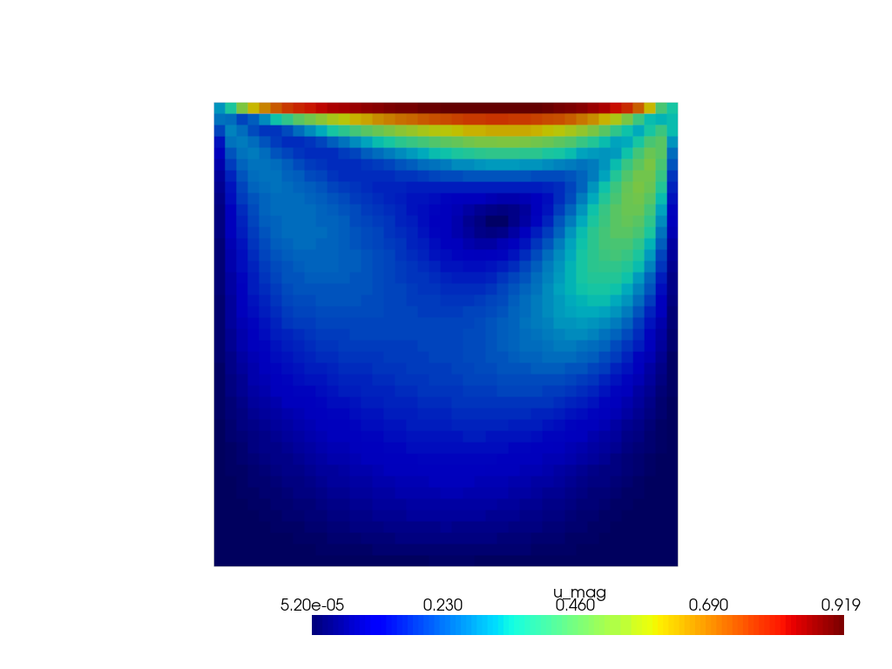

# Warp CFD

A Python based 3D incompressible CFD solver written for GPU CFD using [Nvidia Warp](https://github.com/NVIDIA/warp). The aim is to hopefully create a reasonably fast solver that is easy to tinker and make changes without needing to leave python. The code is also designed with the intention of Deep learning integration in mind and so results should easily be converted to tensor format/graph based tensor format. Warp provides a good path of integrating the following:

- Deep Learning Integration
- GPU computing
- Distributed Computing

This code is a fun side project to better understand CFD and how to implement it. A lot of inspiration of how to represent the computations was taken from [FiPy](https://www.ctcms.nist.gov/fipy/). Initially written for Taichi Lang, Warp was used in favour for its current better maintenence and restrictions that help prevent users from shooting themselves in the foot such no implicit fp operations of different types and mandatory type annotations for kernels. 

# Examples:

Steady State Lid Driven Cavity (Re=100) 41x41 hex elements for 2000 iterations with velocity and pressure relaxation factors of 0.7 and 0.3 respectively:

<p float='middle'>
  
</p>


<p float="left">
  
  
</p>


# Installation
```bash
git clone https://github.com/JohnCSu/WarpCFD.git
cd WarpCFD
python3 -m pip install -e .
pip install -r requirements.txt
```


# RoadMap (In hopeful order)
- ~~Implement SIMPLE loop~~  
- Add Pressure inlet/outlet
- ~~Add And Test Tetra Elements~~
- ~~Add And Test Wedge Elements~~
- ~~Implement Skewness corrections~~
- Orthogonal Correctors (Use over relaxed approach but may change)


- Add unsteady flow
    - Pseudo Transient
    - PISO
    - PIMPLE

- Rendering Results (currently using pyvista)

- Add RANS Correction
    - k-epsilon
    - k-omega
 
- Add Explicit solver
    - Backpropagation capability
- Mesh module overhaul (spaghetti doesnt begin to describe it)
## Far in Future
- Add LES
- LBM implementation
- distributed computing
- adaptive meshing
- mixed precision


## What I won't work on
- Meshing (go to gmsh for that and import it to pyvista) 

# License
AGPL. You are welcome to use this for personal and research use.